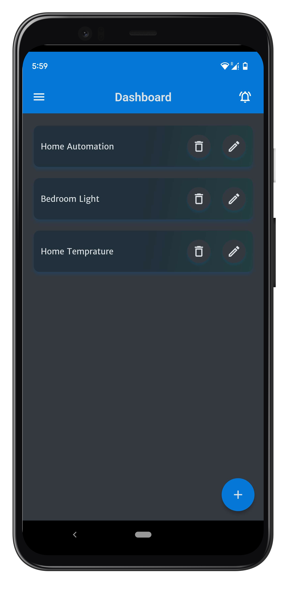
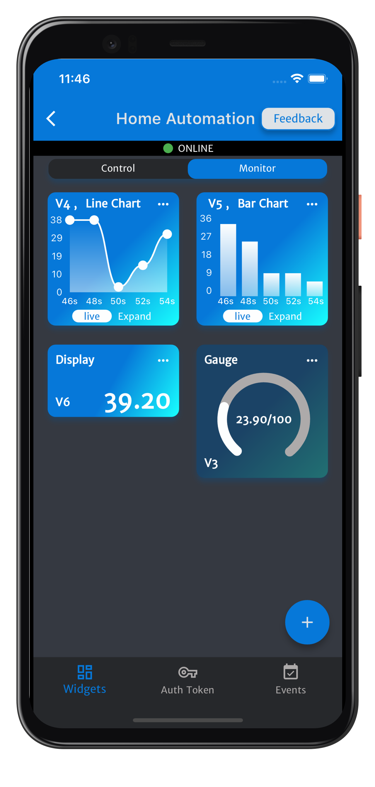

```cpp
  _______ _     _                 _ _       _             
 |__   __| |   (_)               | (_)     | |            
    | |  | |__  _ _ __   __ _ ___| |_ _ __ | | _____ _ __ 
    | |  | '_ \| | '_ \ / _` / __| | | '_ \| |/ / _ \ '__|
    | |  | | | | | | | | (_| \__ \ | | | | |   <  __/ |   
    |_|  |_| |_|_|_| |_|\__, |___/_|_|_| |_|_|\_\___|_|   
                         __/ |                            
                        |___/                             
```

# ThingsLinker C++ Library

<!-- <h3>ThingsLinker library now support MQTT protocol. Thia library uses the PubSubClient library, which can easily be accessed at <a href="http://arduino.cc/en/guide/libraries" rel="nofollow">http://arduino.cc/en/guide/libraries</a>, to enable MQTT functionality.</h3>
<br> -->
### ThingsLinker is an Internet of Things (IoT) platform that enables remote management and control of IoT devices.
 - With ThingsLinker, you can effortlessly connect and control both ESP8266 and ESP32 devices.
 - With web and mobile applications, ThingsLinker simplifies IoT device management and enables users to monitor and control their devices from anywhere
 - ThingsLinker provides a wide variety of customizable widgets that allow users to monitor and control any type of device, including sensors and gauges. These widgets can be easily configured to suit the specific needs of each device, providing users with a tailored experience that meets their unique requirements

# Quickstart: 

 
  

### To use the ThingsLinker library, follow these steps:
  * Download the ThingsLinker app or use website ( [Google Play](https://play.google.com/store/apps/details?id=com.cloud.thingslinker), [Web](https://thingslinker.com),)
  * Get the Auth Token from the app
  * Download the ThingsLinker library
  * Import the library to Arduino IDE (check out the guide <a href="http://arduino.cc/en/guide/libraries" rel="nofollow">here</a>)
  * In Arduino IDE, select File -> Examples -> ThingsLinker -> ThingsLinkerButton
  * Update your auth token in the sketch and upload it to your Arduino device

# Usage
### Example: [here](https://github.com/ThingsLinker-Libraries/thingslinker-library/tree/main/examples)
#### To use the ThingsLinker library in your sketch, include the following line at the top:

```cpp
#include <ThingsLinker.h>
```

#### Following statement creates an instance of the ThingsLinker library called "thingsLinker". which will be use to access the various functions and features provided by ThingsLinker.

```cpp
ThingsLinker thingsLinker;
```

#### The `begin` function initializes the ThingsLinker library, allowing the device to connect to the internet and authenticate with the ThingsLinker platform, which enables IoT functionality..
  - `Required paramters`
    - SSID:  A unique name that identifies a wireless network
    - password: Wi-Fi password
    - authentication token: auth token of project provided by ThingsLinker.

```cpp
void setup()
{
 thingsLinker.begin(ssid, password, authToken);
}
```

#### The `subscribePin` function in ThingsLinker is used to subscribe to a virtual pin, for example, V0. This enables the device to receive updates whenever the value of the subscribed pin changes.
  - `Paramer required`
    - "V0": virtual pin name

```cpp
void setup()
{
  thingsLinker.subscribePin("V0");
}
```

 #### The `setCallback` function of the thingsLinker is use to set a callback function that will be executed when a message is received on any subscribed virtual pin.. 
  - `Paramer required`
    - callback: callback function

```cpp
void setup()
{
  thingsLinker.setCallback(callback);
}
```

#### The `callback` function is used to retrieve the value of the subscribed pin and implement custom logic on that value. In the following example,The `getButtonAsInt` function is used to retrieve the current value of virtual pin `V0` and store it in the "buttonStatus" variable. The variable is then printed.

```cpp
void callback()
{
  int buttonStatus = thingsLinker.getButtonAsInt("V0"); 

  Serial.print("Get Button Status: "); 
  Serial.println(buttonStatus);

  // Your custom logic
}
```

#### The `loop` function in the ThingsLinker instance allows the library to continuously listen for incoming messages and execute the associated callback function when a message is received. This function should be called in the device's main loop to enable ThingsLinker to function correctly.

```cpp
void loop()
{
  thingsLinker.loop();
}
```
### The `event` function enables you to trigger notifications within the app. You can invoke this function within a conditional logic that checks for alteration, information, or warning conditions.
  - `Paramer required`
    - eventkey: An event key is generated by the app

```
thingsLinker.event("YourEventKey");
```
<br>

# ThingsLinker Widgets Examples
## ThingsLinker control widgets example
<br>
<h3>ThingsLinker offers various widgets that you can use to display or publish data. Here are some examples:</h3>
<br>

### Get Button Value Example
<br>

#### This example shows how to retrieve an integer value from the ThingsLinker platform by calling the `getButtonAsInt` method of the `thingsLinker` object.</p>

```cpp
void callback()
{
  int buttonStatus = thingsLinker.getButtonAsInt("V0"); 

  Serial.print("Get Button Status: "); 
  Serial.println(buttonStatus);

  if (buttonStatus == 0) 
  {
    digitalWrite(LED_PIN, LOW); 
  }
  else if (buttonStatus == 1) 
  {
    digitalWrite(LED_PIN, HIGH); 
  }
}
```

### Get Slider Value Example
<br>

#### This example shows how to retrieve an integer value from the ThingsLinker platform by calling the `getSliderAsInt` method of the `thingsLinker` object.

```cpp
void callback()
{
  int sliderValue = thingsLinker.getSliderAsInt("V0");
  Serial.print("Get getSliderAsInt: "); 
  Serial.println(sliderValue);         
}
```

### Get Timer Value Example
<br>

#### This example shows how to retrieve an integer value from the ThingsLinker platform by calling the `getTimerAsInt` method of the `thingsLinker` object.

```cpp
void callback()
{
  int timerStatus = thingsLinker.getTimerAsInt("V0");
  Serial.print("Get Button Status: ");
  Serial.println(timerStatus);
  if (timerStatus == 0)
  {
    digitalWrite(LED_PIN, LOW); 
  }
  else if (timerStatus == 1)
  {
    digitalWrite(LED_PIN, HIGH);
  }
}
```
### Set Event Example
<br>

#### This example demonstrates the usage of the `event` function to trigger 'Notifications' or 'Alert' on the ThingsLinker app

```cpp
void loop()
{
  thingsLinker.loop();
  float y = random(1, 401) / 100.0;  

  
  Serial.print("Value: ");  
  Serial.println(y);  

  if(y < 20){ 
    // Event will trigger when y is less than 20
    thingsLinker.event("YourEventKey"); 
  }

  thingsLinker.setDisplay("V3", y); 
}
```

## ThingsLinker monitor widgets example
<br>

### Set Chart Example
<br>

#### This example shows how to use the `setChart` function to publish data on the ThingsLinker platform.

```cpp
void loop()
{
  thingsLinker.loop();
  float y = random(1, 401) / 100.0;  

  Serial.print("Value: ");  
  Serial.println(y);  

  thingsLinker.setChart("V3", y); 
}
```
### Set Gauge Example
<br>

#### This example shows how to use the `setGauge` function to publish data on the ThingsLinker platform for gauge display.

```cpp
void loop()
{
  thingsLinker.loop();
  float y = random(1, 401) / 100.0;  
  Serial.print("Value: ");  
  Serial.println(y); 

  thingsLinker.setGauge("V3", y);  //platform for gauge display
  delay(1000); 
}
```

### Set Display Example
<br>

#### This example shows how to use the `setDisplay` function to publish data on the ThingsLinker platform.

```cpp
void loop()
{
  thingsLinker.loop();
  float y = random(1, 401) / 100.0;  

  
  Serial.print("Value: ");  
  Serial.println(y);  

  thingsLinker.setDisplay("V3", y); 
}
```  
# ThingsLinker Documentation

  ### ThingsLinker [Official Website](https://thingslinker.com)


# License
<p>This project is released under The MIT License (MIT)</p>
